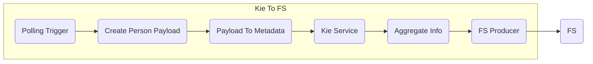

# Kie Testing

[](https://github.com/interlok-testing/testing_kie/blob/develop/LICENSE)
[](https://github.com/interlok-testing/testing_kie/actions/workflows/gradle-build.yml)

Project tests interlok-kie features

## What it does

This project is very simple and contains only one channel with one workflow.

The workflow has a polling trigger that produces a message every 10 seconds and adds a Person payload (a marshalled version of the a Person model object, [see custom code below](#custom-code)), copies it to metadata, runs it trough a Kie service, aggregates the data and finally copies the message on the file system.



## Getting started

* `./gradlew clean build`
* `(cd ./build/distribution && java -jar lib/interlok-boot.jar)`

The config is using a variables.properties to configure the rule directory and the file system directory.

```
rulesDir=file://localhost/./config/rules
fsDir=file://localhost/./messages/in
```

## Custom Code

Interlok Kie requires some model classes that are used in the rule file `choose-computer.drl`.
The Computer, Desktop, Laptop, Person classes (taken from interlok-kie tests) have been added in src/main/java/com/adaptris/kie/model.

The model classes are built into a jar file which is added in interlok lib directory when running `./gradlew clean build` or `./gradlew clean asemble`
